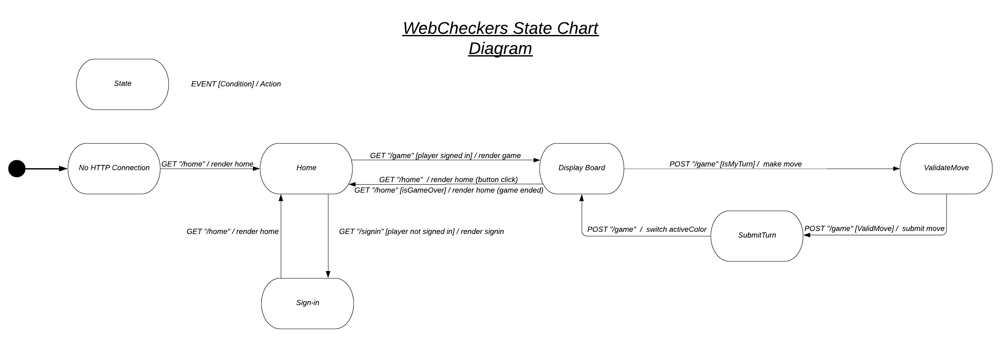
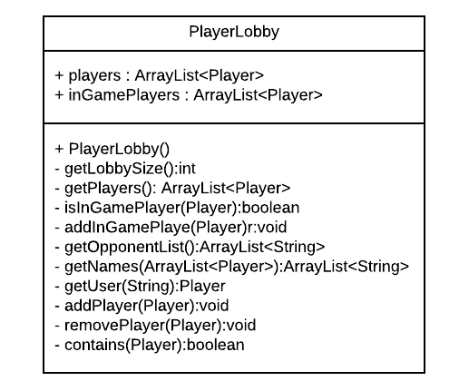
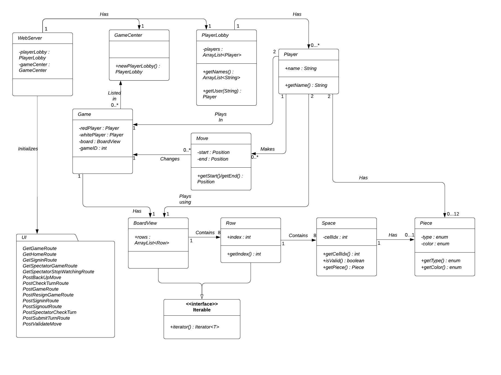

# PROJECT Design Documentation

## Team Information
* Team name: team e
* Team members
  * Ben Jordan  
  * Adam Mercer
  * James Clementi

## Executive Summary

### Purpose
The purpose of this project is to create a web based checkers application that allows the user, anyone who wants
to play checkers, play remotely with another user.

### Glossary and Acronyms

| Term | Definition |
|------|------------|
| VO | Value Object |
| GB | Game Board   |
| MVP | See Definition in Section 2 |

## Requirements

This section describes the features of the application.

Our Trello board contains all the requirements needed for a successful implementation of the project. Important 
features include Player Sign-in, Starting a game, Player Sign-out, Making a move, Promotion, Resignation, and Winning 
the game. All of these stories pertain to the Gameplay and GUI epics. For example, A promoted piece must be represented 
graphically and with the ability to move backwards.

### Definition of MVP

The MVP for this project involves the ability for two players to be able to log in and out of a WebCheckers lobby, play 
a game where they make moves abiding by the rules, are able to play until one player has no more pieces or one resigns, 
and declaring victory for the player with at least one remaining piece.

### MVP Features

Notable MVP Features include
Player Sign-in, Player Sign-out, Start a Game, Make Move, Resignation, and Has Won, which all fall under the Gameplay 
or GUI epics.

### Roadmap of Enhancements

For our project, we included a spectator enhancement that allows users to spectate a game between two other players in
real time.

## Application Domain

Domain Model:

-page-0.png)

In our domain model, we've highlighted the key entities that are involved in process of playing
a game of checkers. The game begins with a player, who is either in the regular play mode or spectator mode depending
on the game state.
The model then shows how the player has a single GB and interacts with each of the 24 pieces on the GB by 
making a valid move. 

## Architecture and Design

This section describes the application architecture.

### Summary

The following Tiers/Layers model shows a high-level view of the webapp's architecture.

As a web application, the user interacts with the system using a
browser.  The client-side of the UI is composed of HTML pages with
some minimal CSS for styling the page.  There is also some JavaScript
that has been provided to the team by the architect.

The server-side tiers include the UI Tier that is composed of UI Controllers and Views.
Controllers are built using the Spark framework and View are built using the FreeMarker framework.  The Application and
Model tiers are built using plain-old Java objects (POJOs).

Details of the components within these tiers are supplied below.

### Overview of User Interface

From the user perspective, the ui in this application is fairly straightforward. Once the user enters
the website, they are brought to the Home page. This page allows a user to sign-in, taking them to
the Sign-In page solely dedicated to this task. The Home page also allows users to see other users
and start a game with them. Doing so brings the user to the Game page.

### UI Tier

In our UI tier, we have the route classes. These classes are responsible for communication between the java brains of
the application and the UI components and directing the user to the required UI location. All of these classes' 
constructors have similar signatures usually consisting of a template engine used to render the webpages, a game center 
used to query game information, a player lobby used to query players, and a Gson instance.

Here's an example of what the GetHomeRoute class looks like.

Inside handle, the main functionality lies in a ModelandView hash table used to transfer data between the spark ui and
the Java components, and a template engine used to render the ui itself.

This sequence diagram shows a timeline of what goes on in the handle function in GetGameRoute, as well as a simplified 
loop of how a game is played.

### Application Tier
For the application tier of our project, we've decided to use three components, the PlayerLobby, the WebServer, 
and the GameCenter. The player lobby is used to store the information of all users who are signed in, and all users who
are currently playing a game. All of the functions are responsible for querying and searching for the Players stored 
in the lobby.
    

As for the other two components, the WebServer is responsible for coordinating the UI Routes. It stores route urls,
and helps to initialize the pages when accessed by the user. The GameCenter class is essentially to Game what
Player is to PlayerLobby. This class stores game instances and information about these instances, and allows other
classes to query this data.
    
### Model Tier
The purpose of our model tier is exactly what you might assume. These classes are deigned to model the domain of a 
real life checkers game. The classes in this tier include BoardView, Game, Move, Position, Piece, Row, Space, 
and Player.

    
What one might consider to be the main class in this tier is the WebServer. The flow of the model begins with the Piece
class, which are created and added to instances of Space. These instances are added to Row instances, which are added to
an array list of Rows in BoardView. As you can see, they all work together to create the BoardView. The BoardView makes
playing a game possible by allowing a user to see the game board. The other classes Position, Move, and Game are all 
there to model the logistics and rules of checkers.

### Design Improvements
The main way our design could be improved is by adding more enhancements. Although we've implemented spectator to work
as described, we feel that if we had more time, there's functionality that could still be added to spectator to improve
the user experience. Additionally, we had ideas for other enhancements such as an AI player that would have made the
game more interesting for the user.

## Testing

Our testing strategy involved debugging through a debugging tool, through periodic print statements, and unit tests.
We frequently test elements of the story we are working on as we develop it and run more thorough tests after it is 
"finished". For example while developing the PostSigninRoute, tests were done after each if statement was made to
verify the logical conditions of each if statement could be met and the correct result was achieved. After each if 
statement was created and the class was finished some unit tests were written and manual tests were ran.

### Acceptance Testing

Although our initial acceptance testing showed us we had bugs we needed to work out, we believe that these bugs have
been removed from the project in our testing.

### Unit Testing and Code Coverage
Unit tests cover only part of each tier, the application tier has tests for the GameCenter class which test 100% of the 
methods in GameCenter. The Model tier has unit tests for the Piece and Player classes which both have 100% of the code 
covered. The UI tier tests include GetHomeRouteTest, GetSigninRouteTest and PostSigninRouteTest these classes were 
covered only partially and need more tests to be complete. Each tier has classes that are yet to be tested and tests 
will be implemented in the coming sprints.
